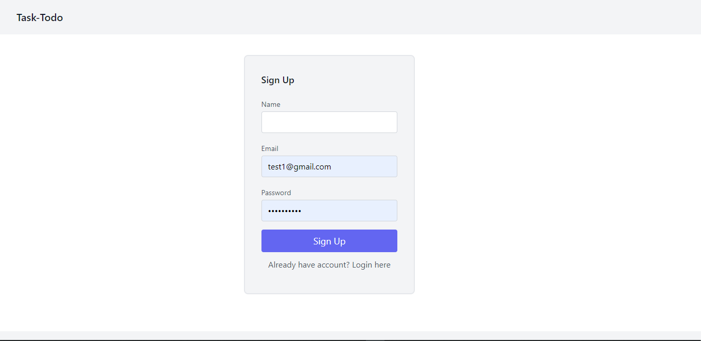

### Task Todo 
-----
Full fledge Task-todo web application

  

### Things Learn from the project
- More about React   
- More on tailwind css
- node for the backend
- appwrite for authentication
- mongodb atlas for the database
- Hosting in netlify and railway
### ScreenShot

### Note- 
- frontend and backend are hosted successfuly on netlify and railway
- appwrite authentication service is yet to be hosted
- Works only in local system for now 
